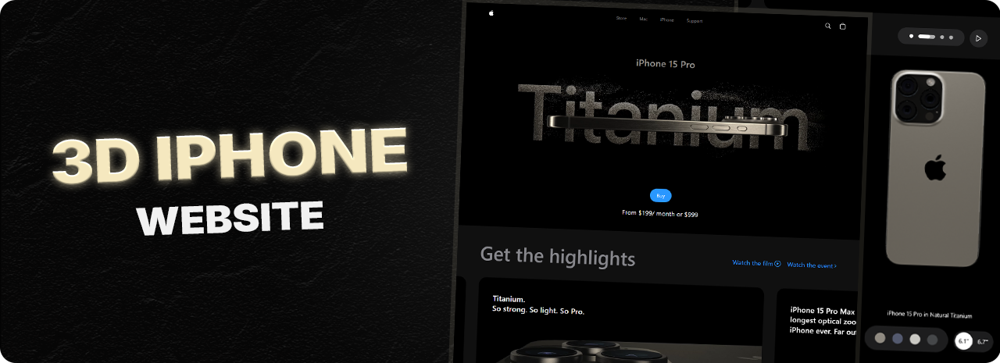

   
  
   
  

    
    
    
    
    
  

  <h3 align="center">3D iPhone Experience</h3>

  

    A sleek, high-fidelity 3D representation of the iPhone 15 built with Three.js and GSAP.  
    Inspired by Apple’s design philosophy, this experience delivers smooth interaction, responsive UI, and immersive visuals — all crafted using a modern, performance-first tech stack.
  

---

## Features

- Interactive 3D iPhone 15 rendered with precision using Three.js
- Fluid animations and transitions powered by GSAP
- Clean, modern interface developed with React and Tailwind CSS
- Responsive layout optimized for all devices
- Video carousel inspired by Apple product pages
- Lightning-fast development and build workflow with Vite

---

## Tech Stack

* [Three.js](https://threejs.org/)
* [GSAP](https://gsap.com/)
* [React](https://reactjs.org/)
* [Vite](https://vitejs.dev/)
* [Tailwind CSS](https://tailwindcss.com/)

Live Demo [View Live Site](http://iphone3d-1.web.app)

---

## Contact

Available for freelance projects and collaborations.

Contact: **[yahialord4315@gmail.com](mailto:yahialord4315@gmail.com)**  
Portfolio: **[https://portfolio25-one.vercel.app/](https://portfolio25-one.vercel.app/)**

---

## License

MIT License © 2025 Yahia Badr
