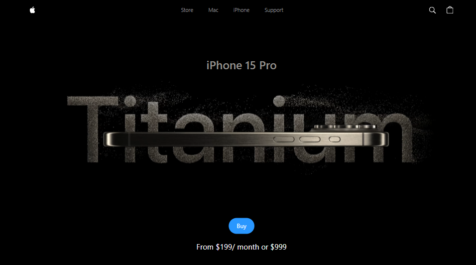

# 📱 3d-Iphone

A stunning 3D iPhone experience built with **Three.js**, **GSAP**, **React**, **Vite**, and **Tailwind CSS**. Inspired by Apple’s sleek style, this project features a realistic 3D model of the iPhone 15 with smooth animations and a video carousel.

## ✨ Features

- 📱 Realistic 3D iPhone 15 model (interactive and animated)
- 🎞️ Video carousel styled like Apple product pages
- 🌀 Smooth GSAP animations and transitions
- ⚡ Fast and modern setup with Vite
- 💻 Clean UI with React + Tailwind CSS

## 🛠️ Tech Stack

- [Three.js](https://threejs.org/) – 3D rendering engine
- [GSAP](https://gsap.com/) – Animation library
- [React](https://reactjs.org/) – UI components
- [Vite](https://vitejs.dev/) – Lightning-fast build tool
- [Tailwind CSS](https://tailwindcss.com/) – Utility-first styling

## 📸 Preview

  
[Live Demo](http://iphone3d-1.web.app)

## 📄 License
MIT License © 2025 Yahia Badr
